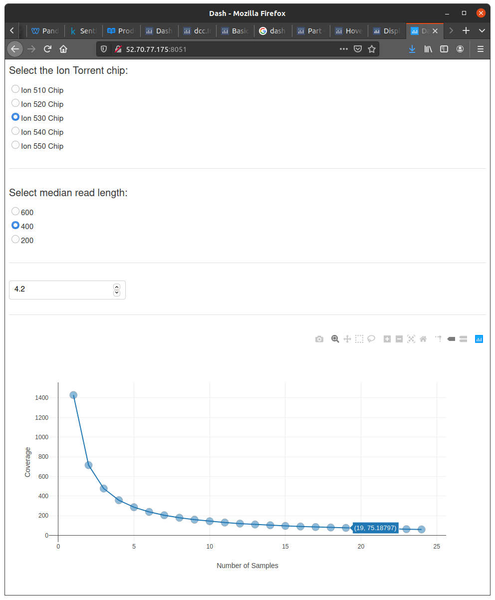

Dash app to calculate and visualize theoretical multiplexed coverage from Ion Torrent sequencing with options for chip, median read length, and genome size.

**Local Installation**

```bash
# First install the necessary dependencies:
conda install -c anaconda -c conda-forge "python>=3.7.6" plotly dash pandas numpy

# Then clone the app repository:
git clone https://github.com/stonyc/dash-torrent-coverage.git

# Then to run the application, go to the cloned repository folder and enter:
python app.py
```

**Browser Access:

Finally, open a Chrome browser window to your computer IP address to access the application:

```bash
http://<your-ip-address>:8051
```

**Screenshot**


